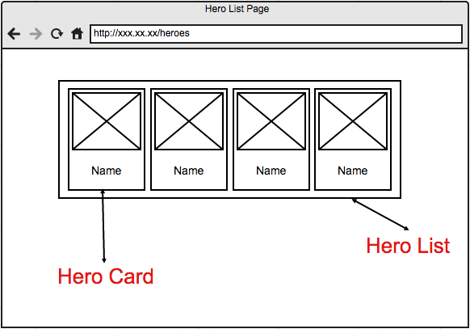
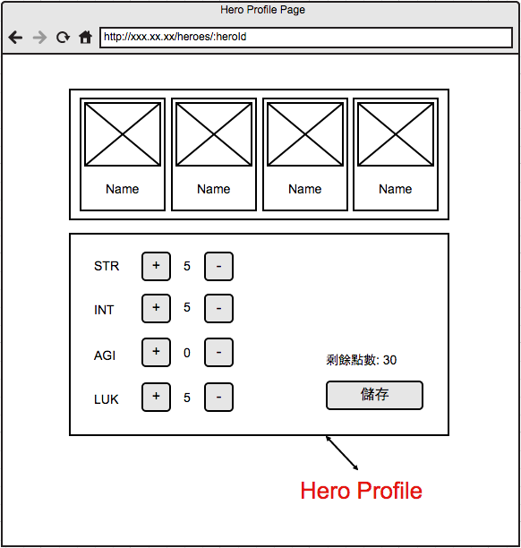

# Hahow Frontend Engineer 徵才小專案

這是一個小型的徵才專案，會需要你使用 JS framework 和 backend API 所提供的資料，依照 wireframe 來完成頁面。


## 細部需求

- 請參考 **wireframe** 及 **頁面需求** 實作這個專案
- 請使用你習慣使用的 JS framework e.g. Vue、Angular、React，如果沒有習慣使用的 framework，請盡量使用 React
- 使用 git / GitHub 來做整個專案的版本控管
- 請將小專案上傳到 GitHub， **不接受以 Dropbox 或信件夾帶壓縮檔的形式繳交作業**
- 提供一份文件說明：
    - 我們該如何執行完成的 package
    - 專案的架構，Web 的架構邏輯
    - 你對於所有使用到的第三方 library 的理解，以及他們的功能簡介
    - 你在程式碼中寫註解的原則，遇到什麼狀況會寫註解
    - 在這份專案中你遇到的困難、問題，以及解決的方法

## 加分建議

- 程式的可讀性與可維護性
- 使用 CSS framework
- 任何你覺得可以讓網頁變得更 fancy 或是很酷的事情

# 頁面需求

- 整個專案會需要兩個頁面
    - Hero List Page (網址: `/heroes`)
    - Hero Profile Page (網址: `/heroes/:heroId`)
- "Hero List Page" 、 "Hero Profile Page" 都有一個 "Hero List" 在頁面上水平置中 (API: `GET https://hahow-recruit.herokuapp.com/heroes`)
- "Hero List" 上的元素我們稱為 "Hero Card"，在 "Hero List" 中由左到右排列，如果在小尺寸螢幕上列表中的元素超出畫面就自動往下排列
- "Hero Card" 必須包含圖片和名字，且是可以點擊的連結
- "Hero Card" 連結會連到單一Hero的 "Hero Profile Page" ，"Hero List" 依然在相同位置，並且不因切換連結重新render
- 當在 "Hero Profile Page" 時要將現在所選中的 "Hero Card" 用不同的顏色或圖案標示出來
- "Hero Profile Page" 中，在"Hero List" 底下會有一個 "Hero Profile"
- "Hero Profile" 會顯示 Hero 的能力值 (API: `GET https://hahow-recruit.herokuapp.com/users/:userId/profile`) ，並且在數值左右各有一個按鈕，負責做增減功能，另外有一個顯示剩餘的能力點數的地方，一開始預設值是 0
- "Hero Profile" 最下方有一個儲存按鈕，按下按鈕後，會將現在設定的能力值提交更新 server 上的資料 (API: `PATCH https://hahow-recruit.herokuapp.com/users/1/profile`)，送出的能力值總和必須與拿到的時候相同
- Hero 能力值不能小於零

## 最後

當你完成的時候，將你的git commit記錄一併打包傳給我們（郵件或是給我們連結）。

同時我們也認為在程式開發的過程中溝通是很重要的，所以如果過程中你有任何問題，不論是看不懂我們所寫的文件，或是對於我們提供的 API 有疑問，都歡迎直接 e-mail 和我們討論。

## Wireframe






## 我們所提供的資料及 API

### List Heroes [GET] http://hahow-recruit.herokuapp.com/heroes

**Request**

```
curl -H "Accept: application/json" -H "Content-Type: application/json" -X GET http://hahow-recruit.herokuapp.com/heroes
```

**Response 200**

```json
[
    {
        id: "1",
        name: "Daredevil",
        image: "http://i.annihil.us/u/prod/marvel/i/mg/6/90/537ba6d49472b/standard_xlarge.jpg"
    },
    {
        id: "2",
        name: "Thor",
        image: "http://x.annihil.us/u/prod/marvel/i/mg/5/a0/537bc7036ab02/standard_xlarge.jpg"
    },
    ...
]
```

### Single Hero [GET] http://hahow-recruit.herokuapp.com/heroes/:heroId

**Request**

curl -H "Accept: application/json" -H "Content-Type: application/json" -X GET http://hahow-recruit.herokuapp.com/heroes/1

**Response 200**

```json
{
    id: "1",
    name: "Daredevil",
    image: "http://i.annihil.us/u/prod/marvel/i/mg/6/90/537ba6d49472b/standard_xlarge.jpg"
}
```

### Profile of Hero [GET] http://hahow-recruit.herokuapp.com/heroes/:heroId/profile

**Request**

```
curl -H "Accept: application/json" -H "Content-Type: application/json" -X GET http://hahow-recruit.herokuapp.com/heroes/1/profile
```

**Response 200**

```json
{
    str: 2,
    int: 7,
    agi: 9,
    luk: 7
}
```

### Patch Hero's Profile [PATCH] https://hahow-recruit.herokuapp.com/heroes/:heroId/profile

**Request**

```
curl -X PATCH -H "Content-Type: application/json" -d '{ "str": 6, "int": 7, "agi": 7, "luk": 5 }' "https://hahow-recruit.herokuapp.com/heroes/1/profile"
```

**Response 200**

```plain
OK
```
